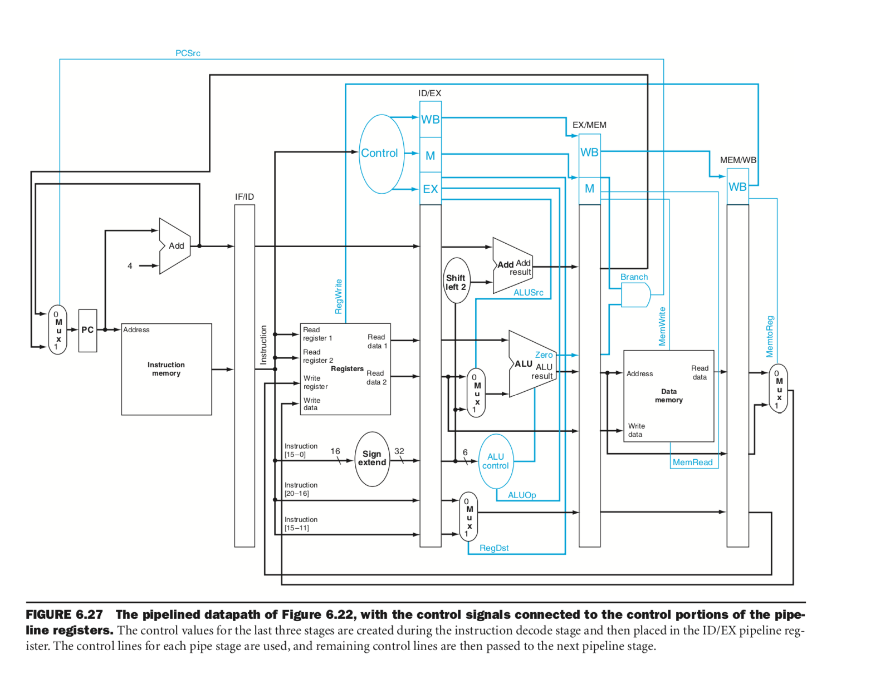

## Project1

### Part 1 - support AddOK and BitCount

* Firstly, objdump test1

  ```shell
  $IDIR/bin/sslittle-na-sstrix-dump -d test1 
  ```

* in <addOK> function from dumped file, we can saw the unknown instruction, inferred as addOK instruction.

  ```
  00400240 <addOK>:
    ...
    400268:	34 00 00 00 	sw $19,28($29)
    40026c:	1c 00 13 1d 
    400270:	61 00 00 00 	0x00000061:10111300
    400274:	00 13 11 10 
    400278:	34 00 00 00 	sw $31,32($29)
    40027c:	20 00 1f 1d
    ...
  ```

* we got 0x61 for instruction addok, then we fix machine.def

  ```c
  /*
   * addOK and bitCount operations
   */ 
  #define ADDOK_IMPL            \
    {                 \
      if (OVER(GPR(RS), GPR(RT))) { \
        SET_GPR(RD, 0);  \
      } else {  \
        SET_GPR(RD, 1); \
      } \
    }         
  DEFINST(ADDOK, 0x61,
    "addok", "d,s,t",
    IntALU, F_ICOMP,
    DGPR(RD), DNA, DGPR(RS), DGPR(RT), DNA) 
  
  ```

* Similarly, we add the following in machine.def for bitCount instruction

  ```c
  #define BITCOUNT_IMPL							\
    {									\
      int n = GPR(RS); \
      int count = 0;  \
      while (n != 0) {  \
        n = n & (n - 1);  \
        count++;  \
      } \
      if (UIMM) { \
        SET_GPR(RT, count); \ 
      } else {  \
        SET_GPR(RT, 32 - count); \
      } \
    }
  DEFINST(BITCOUNT, 			0x62,
  	"bitcount",			"t,s,u",
  	IntALU,			F_ICOMP|F_IMM,
  	DGPR(RT), DNA, 		DGPR(RS), DNA, DNA)
  
  ```

### Part2 - Sim-pipeline

#### Basic Pipeline Design



improvement to our base pipeline

* In order to support Jump signal, we add jump unit in ID stage. When Jump signal is activated, we transfer jump address(i.e. instruction[25:0]) to PC unit.
* Change Branch signal from MEM stage to EX stage. While ZERO of ALU unit and Branch signal are both activated, ALU result will be chosen to the next PC.
* Divide signal ALUSrc to ALUSrcA and ALUSrcB. ALUSrcA choose the data source(GPR(RS), shamt(for sll inst.) of zero(for lui inst.)) to be the first input of ALU unit, while ALUSrcB choose the data source(GPR(RT), extend_imm, up_extend_imm(for lui inst.))  

#### Harzard with only stall

Without forwarding and branch prediction, we totally use stall strategy for all harzards.

* Control harzard will happen when Branch signal activated. For instructions with Branch signal(e.g. bne in this project), we just flush the inst. in DE buffer with nop and load target address for next pc.

* Data harzard will happen when register read-write conflict appear. We just stall instructions in DE and ID buffer until the register has been written back.

#### Hazard with stall, forwarding and branch prediction

With forwarding and branch prediction, hazards will be decreased and our stall strategy will be simpler.

* Control harzard will happen when Branch signal is activated and alu_zero is false at EX stage. In this case we just flush the inst. in DE buffer with nop and load target address for next pc.
* Data harzard will happen for the instructions which will write the register (to be read by next instruction) but the written value will be computed until EM stage (As we know, if the written value could be computed in EX stage, forward strategy will avoid the data harzard.). So in this case, we stall the instruction until the written value has been computed.

#### Instructions

This pipeline support all the instructions in loop.s.

For detailed information, see [inst_list](./inst_list.md)