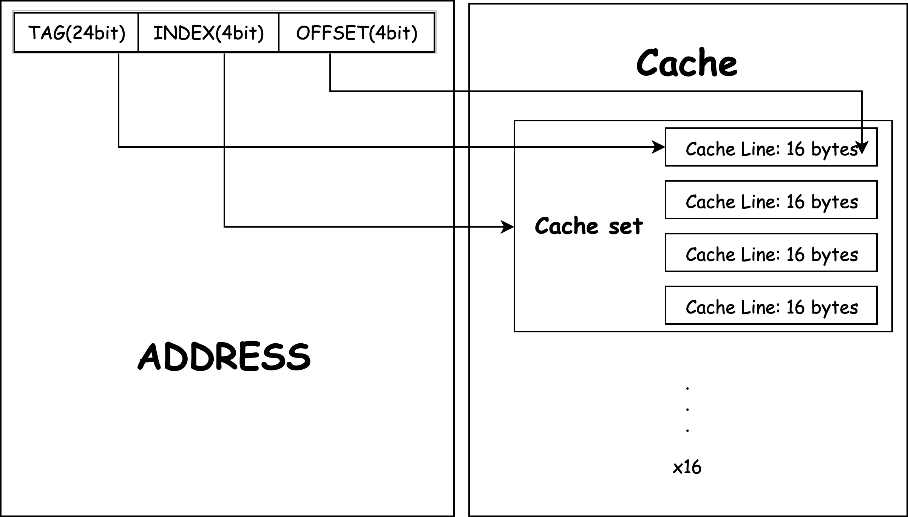

## Project2

### Design of cache organization



* Four-way set-associative cache with 16 cache sets in total
* Unified cache used for both instruction and memory access
* 16 bytes in each cache line with data

#### cache_line

```c
typedef struct cache_line {
    unsigned int data[4];     
    unsigned int tag:27;      
    unsigned int dirty:1;   
    unsigned int valid:1;    
    unsigned int ref_count:19;     
    struct cache_line *next;    
} cache_line_t;
```

* data: data in cache line with total size of 4 bytes 
* tag: marked for addressing
* dirty:  whether the cache_line has been written
* valid:  whether the cache_line has been in use
* ref_count: reference count 
* next: next cache_line in the same cache set

#### cache_set

```c
typedef struct cache_set {
    cache_line_t *head;        
    cache_line_t *tail;        
    int n;                     
} cache_set_t;
```

* Queue struct is used for each cache_set for implementation of FIFO

#### cache 

```c
typedef struct cache {
    cache_set_t sets[16];      
    unsigned int enable;       
    unsigned int access;    
    unsigned int hit;          
    unsigned int miss;     
    unsigned int replace;      
    unsigned int wb;            
} cache_t;
```


### Statistics

```
Memory Accesses: 11068194
Memory Hits: 10729052
Memory Misses: 339142
Line Replacements: 339078
Line Write-backs: 20214
```

